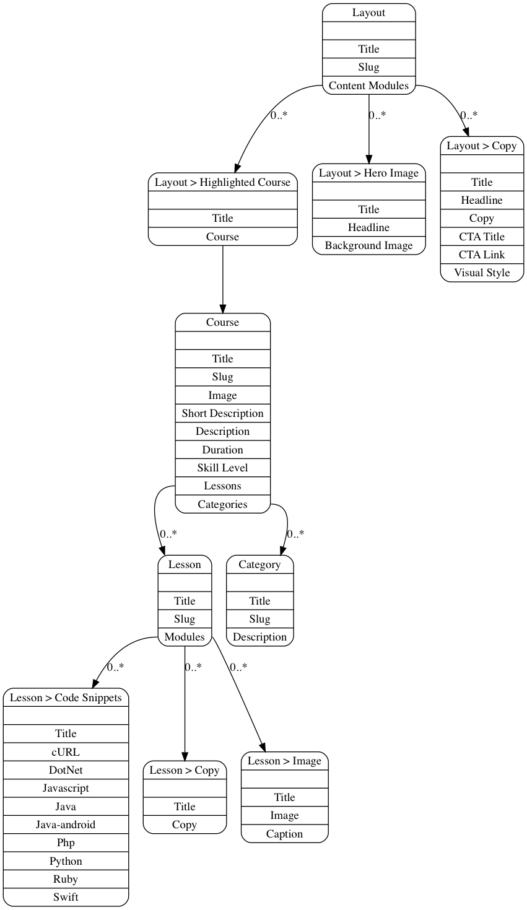

Content model: The example app
================================

The example app content model containts the model for all the example apps, demonstrating in a broader fashion some examples on how to use
Contentful. If you want to see the model in action, we have a [hosted version](https://the-example-app-nodejs.herokuapp.com/), for you
to check out.

Through our [command line app](https://github.com/contentful/contentful-cli) you can import this model into your own space. Doing so will be
accomplished by this call to the command line app:

```
contentful space seed -s '<SPACE_ID>' -t the-example-app
```

The Contentful CLI will walk you through the steps needed in order to import this content model into your space.

If you happen to not have a `<SPACE_ID>`, as in a Space you can overwrite, use the cli to create a new one:

```
contentful space create -n '[COPY] The example app'
```

And then retry the upper code again.


Compatible apps
==========

The content model `The example app` is used in platform specific example apps to form a reference Contentful setup.

| Platform  | Repository | Hosted version |
| - | - | - |
| node.js | [https://github.com/contentful/the-example-app.nodejs](https://github.com/contentful/the-example-app.nodejs) | [the-example-app-nodejs.herokuapp.com](the-example-app-nodejs.herokuapp.com) |


Versions
========

We are hosting different versions of this content model for demo purposes. `The Example App` can be connected to these versions through `variables.env` when run locally or through query parameters when hosted. For example: `https://the-example-app-nodejs.herokuapp.com/?space_id=<YOUR_CLONED_SPACE_ID>&delivery_token=<YOUR_DELIVERY_TOKEN>&preview_token=<YOUR_PREVIEW_TOKEN>`

| Version  | Space Id | Access tokens |
| - | - | - |
| 1.0 | `qz0n5cdakyl9` | Content Delivery API: `580d5944194846b690dd89b630a1cb98a0eef6a19b860ef71efc37ee8076ddb8`, Content Preview API: `e8fc39d9661c7468d0285a7ff949f7a23539dd2e686fcb7bd84dc01b392d698b` |

**Note:** We are sharing read-only tokens here for demo purposes. Tokens should in general be treated like passwords and not be shared with a public audience.

Visual graph of content model
=============================
The following graph was generated using [contentful-graph](https://www.npmjs.com/package/contentful-graph) to visualize the content model.


